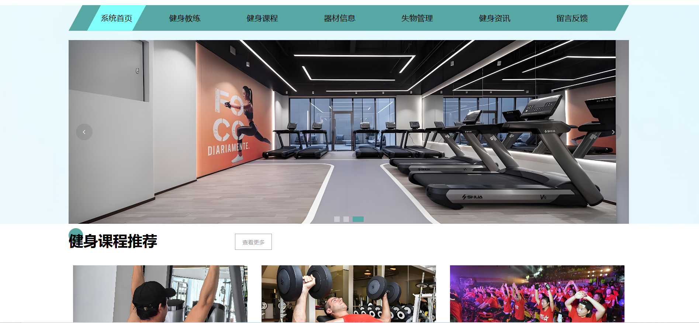

# 基于SpringBoot+Vue的健身房管理系统 

（源代码+12000字文档+ppt）

## 项目简介

健身房管理系统分为用户端和管理端，角色分为管理员、用户、健身教练、员工四个角色。 
管理端是给管理员、员工以及健身教练使用，可以对健身课程、健身器材、器材租赁、健身资讯、轮播图、用户留言反馈、失物招领信息等进行维护，管理员和员工可以管理用户对器材的租用和归还，健身教练可以管理健身课程信息以及用户预约课程信息。 
用户端是给用户使用，可以查看所有教练信息和器械信息，可以预约健身课程以及租用健身器材。 
本系统采用前后端分离的开发模式，前端使用vue框架，后端使用springboot框架。数据库使用的是mysql数据库。 
该系统功能完善，界面美观，非常适合作为毕设或者课程作业以及新手开发学习。 

## 视频介绍
<a href="https://www.bilibili.com/video/BV1qSwae2E3o/" target="_blank">点击查看B站视频介绍</a>

## 功能介绍
 

## 技术服务

## 系统图片
#### 1.登录首页
 
#### 2.统计分析
 
#### 3.健身教练管理
 
#### 4.健身课程管理
 
#### 5.器材信息管理
 
#### 6.健身资讯管理
 
#### 7.用户端首页
 
#### 8.预约课程
 
#### 9.个人中心
 
#### 10.器材租用
 
